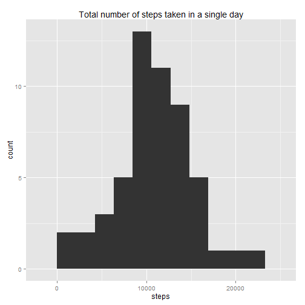
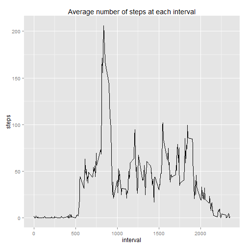
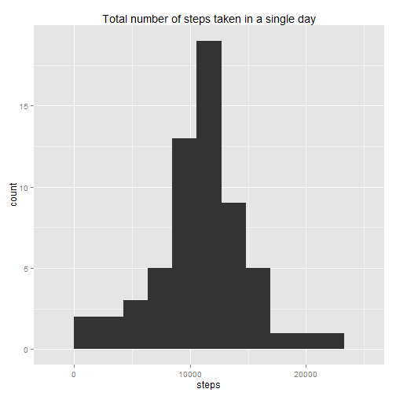
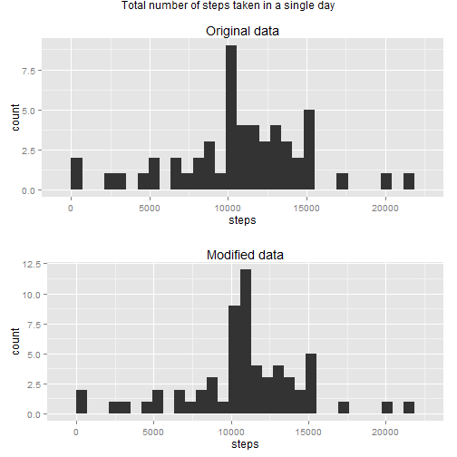
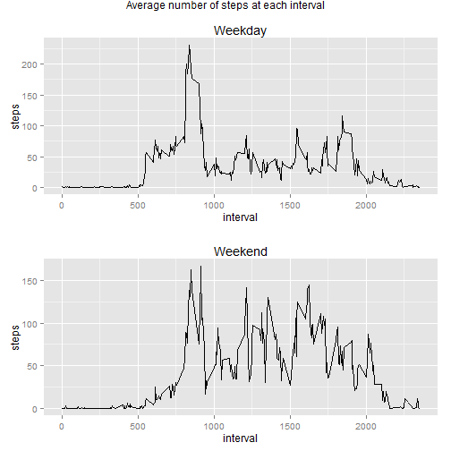

# Reproducible Research: Peer Assessment 1
This exercise makes use of data from a personal activity monitoring device. This device collects data at 5 minute intervals through out the day. The data consists of two months of data from an anonymous individual collected during the months of October and November, 2012 and include the number of steps taken in 5 minute intervals each day.

## Loading and preprocessing the data
First we load the data.  We'll start by checking to see whether the provided zip file has already been extracted, and will extract it as necessary.  Then we'll load the csv file and convert the dates into date format.


```r
if(!file.exists("activity.csv")){
  unzip("activity.zip")
}
activity <- read.csv("activity.csv")
activity$date <- as.Date(activity$date)
```

## What is mean total number of steps taken per day?
To calculate the total number of steps taken each day, it's necessary to sum up the number of steps taken by day - a task easily performed by the aggregate function.  

```r
dailySteps <- aggregate(steps ~ date, data=activity, sum)
```

To get an idea of what we're dealing with, we'll go ahead and plot a histogram of the data using the ggplot2 package.

```r
library(ggplot2)
r.x <- range(dailySteps$steps) # Use the range to set binwidth
qplot(steps, data=dailySteps, binwidth = diff(r.x)/10,
      main="Total number of steps taken in a single day")
```

 

Here are the calculations for the mean and median

```r
mean(dailySteps$steps)
```

```
## [1] 10766
```

```r
median(dailySteps$steps)
```

```
## [1] 10765
```

## What is the average daily activity pattern?
Next we'll take a look at the daily activity pattern by plotting an average of all the five minute intervals across days.  Once again we'll create this summary using the aggregate function, after which we can plot a time series of the 5-minute intervals and the average number of steps taken.

```r
dailyPattern <- aggregate(steps ~ interval, data = activity, mean)
qplot(interval, steps, data=dailyPattern, geom="line",
      main="Average number of steps at each interval")
```

 

Here is the interval ID that on average across all the days in the dataset, contains the maximum number of steps:

```r
dailyPattern[dailyPattern$steps == max(dailyPattern$steps),]$interval
```

```
## [1] 835
```

## Imputing missing values
One item that could be affecting the dataset is the presence of missing values.  This section of the experiment studies the effect of missing values on the overall dataset as well as attempts to fill them in.

First, here is a report of how many missing values exist:

```r
length(which(is.na(activity)))
```

```
## [1] 2304
```

To come up with an estimate for these values, we'll search through our data array for missing interval values and then use daily average for that interval to fill in the missing values.


```r
activityMod <- activity #create our modified version of the data set.
for (i in 1:length(activityMod$steps)){
  if(is.na(activityMod$steps[i])){
    activityMod$steps[i] <-
      dailyPattern[dailyPattern$interval == activityMod$interval[i],]$steps
  }
}
```

Now that we've transformed the data, let's re-create our histogram of total daily steps from above.

```r
dailyStepsMod <- aggregate(steps ~ date, data=activityMod, sum)
r.x <- range(dailyStepsMod$steps) # Use the range to set binwidth
qplot(steps, data=dailyStepsMod, binwidth = diff(r.x)/10,
      main="Total number of steps taken in a single day")
```

 

Re-calculate the mean and median:

```r
mean(dailyStepsMod$steps)
```

```
## [1] 10766
```

```r
median(dailyStepsMod$steps)
```

```
## [1] 10766
```

Note that including the missing data does not appear to have significant impact on our total number of steps per day calculations.  Digging a little deeper, however, we can see minor variations on some days by plotting a more granular histogram.

```r
library(gridExtra)
p1 <- qplot(steps, data=dailySteps, main = "Original data")
p2 <- qplot(steps, data=dailyStepsMod, main = "Modified data")
grid.arrange(p1, p2, main="Total number of steps taken in a single day")
```

 

## Are there differences in activity patterns between weekdays and weekends?
Next we will study the difference between weekdays and weekends.  First, it's necessary to select out the weekdays.

```r
wday <- c("Monday", "Tuesday", "Wednesday", "Thursday", "Friday")
wend <- c("Saturday", "Sunday")
for (i in 1:length(activityMod$date)) {
  if(weekdays(activityMod$date[i]) %in% wday){
    activityMod$weekday[i] <- "Weekday"
  } else if (weekdays(activityMod$date[i]) %in% wend){
    activityMod$weekday[i] <- "Weekend"
  } else {
    print(weekdays(activityMod$date[i]))
    stop("Code error")}
}
activityMod$weekday <- as.factor(activityMod$weekday)
```

Now we can create a plot of weekdays and weekends and see how they compare.

```r
wdayPattern <- aggregate(steps ~ interval,
                         data = activityMod[activityMod$weekday == "Weekday",],
                         mean)
wendPattern <- aggregate(steps ~ interval,
                         data = activityMod[activityMod$weekday == "Weekend",],
                         mean)
pl1 <- qplot(interval, steps, data=wdayPattern, geom="line", main="Weekday")
pl2 <- qplot(interval, steps, data=wendPattern, geom="line", main="Weekend")
grid.arrange(pl1, pl2, main = "Average number of steps at each interval")
```

 

Thanks for reading!
